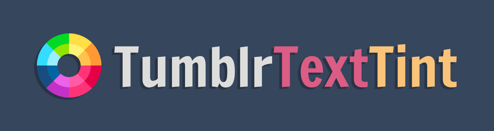

<h3 align="center">
    
</h3>

<h3 align="center">
    Make your Tumblr posts pop with <i>colour</i>
</h3>

  
  
    
    

-------------

### Application Overview

TumblrTextTint is a web application that allows you to format your Tumblr blog posts with a custom color for your text. The application is designed to enhance the aesthetic appeal of your posts, and provide you with more creative freedom by allowing you to choose from a wide range of color options beyond those provided by Tumblr's default formatting options.

With TumblrTextTint, you can easily generate HTML code for a span tag with a style attribute that sets the color of your text. The application is a free and open-source application that is simple, user-friendly, and requires no installation or setup. It is designed to be accessible to users of all skill levels, and is an excellent tool for bloggers, writers, and anyone looking to add a personal touch to their Tumblr posts.

-------------

### How to Use

1. Enter the text you want to format in the text area provided
2. Choose the color you want using the color picker
3. Click the "Generate" button to generate the HTML code
4. Copy the generated code and paste it into your Tumblr post

### Limitations

- The generated HTML code only works for text within a single paragraph (i.e., no line breaks or multiple paragraphs)
- The generated HTML code only sets the color of the text, not any other text formatting (e.g., font size, bold, italic)

### Credits

This web application was created by Loariya-Fiaba ([@xiacodes](https://xiacodes.tumblr.com/)) using HTML, CSS, and JavaScript. The custom cursors used are called "Oxygen Chrome Set" created by Riccardo Laconelli - [link to the cursor set](https://www.cursors-4u.com/cursor/2010/12/17/oxygen-chrome-set.html).

## License

This project is licensed under the MIT License. See the LICENSE file for details.

## Found an issue?

Do report to me by sending an ask via my Tumblr ([link](https://xiacodes.tumblr.com/ask)) about the issue you encounterd! I'll be sure to fix it as soon as possible!
