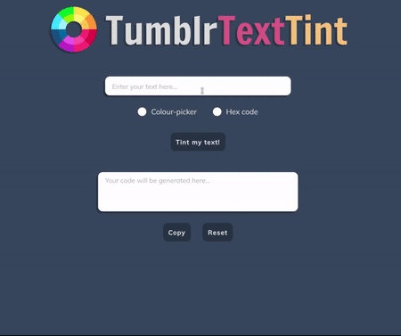
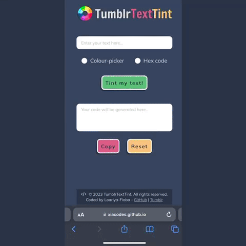
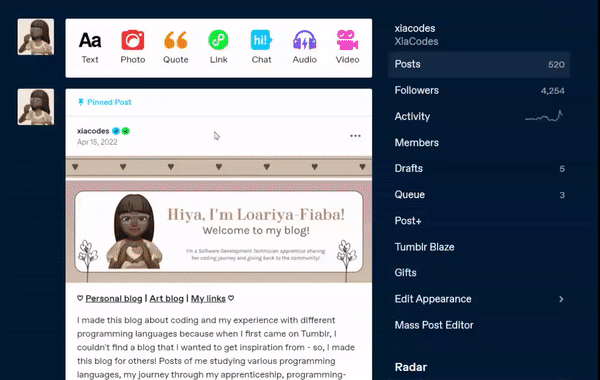

<h2 align="center">
    Instructions for using TumblrTextTint
</h2>

There are two ways of accessing the web app: via your computer or on a smaller mobile device. The instructions will cover both methods. Afterwards, it will show you how to insert the code to your Tumblr blog post. Unfortunately, this method can only be done on a computer or laptop since the option of seeing the rich HTML editor is not available on a mobile device. Without further ado, here's how to use TumblrTextTint!

<h3>Table of Contents</h3>
<ul>
  <li><a href="https://github.com/xiacodes/TumblrTextTint/edit/main/instructions/instructions.md#on-the-computer">On The Computer</a></li>
  <li><a href="https://github.com/xiacodes/TumblrTextTint/edit/main/instructions/instructions.md#on-mobiletablet-devices">On Mobile/Tablet Devices</a></li>
  <li><a href="https://github.com/xiacodes/TumblrTextTint/edit/main/instructions/instructions.md#inserting-the-code-to-your-tumblr-blog-post">Inserting the Code to your Tumblr Blog Post</a></li>
</ul>

-------

<h3>On The Computer</h3>

    

<ol>
  <li>Navigate to the TumblrTextTint website at <a href="https://xiacodes.github.io/TumblrTextTint/">https://xiacodes.github.io/TumblrTextTint/</a></li>
  <li>Type or paste your desired text into the input field.</li>
  <li>Select the color you want for your text from the color picker or by entering the HEX code.</li>
  <li>Click the "Tint my text!" button.</li>
  <li>Click the "copy" button to copy the generated HTML code.</li>
  <li>Click the "reset" button to start again if you need to.</li>
</ol>

-------

<h3>On Mobile/Tablet Devices</h3>

    

<ol>
<li>Open a web browser on your mobile or tablet device.</li>
  <li>Navigate to the TumblrTextTint website at <a href="https://xiacodes.github.io/TumblrTextTint/">https://xiacodes.github.io/TumblrTextTint/</a></li>
  <li>Type or paste your desired text into the input field.</li>
  <li>Select the color you want for your text from the color picker or by entering the HEX code.</li>
  <li>Tap the "Tint my text!" button.</li>
  <li>Tap the "copy" button to copy the generated HTML code.</li>
  <li>Tap the "reset" button to start again if you need to.</li>
</ol>

-------

<h3>Inserting the Code to your Tumblr Blog Post</h3>

To insert the HTML code generated by TumblrTextTint into your Tumblr blog post, you will need to access the rich HTML editor for your post. This can only be done on a computer or laptop, as the rich HTML editor is not available on the mobile version of Tumblr - like I mentioned before.

    

<ol>
<li>Log in to your Tumblr account on your computer.</li>
  <li>Create a new blog post or edit an existing one.</li>
  <li>Type or paste your desired text into the input field.</li>
  <li>Switch to the HTML editor by clicking on the "HTML" button at the top right of the post editor.</li>
  <li>Paste the generated HTML code for the span tag with the style attribute that sets the color of your text into the HTML editor.</li>
  <li>Switch back to the rich text editor to view and edit your post as usual!</li>
</ol>

----------

With these instructions, you can use TumblrTextTint to format your Tumblr blog posts with custom colors for your text!

**Note:** _Make sure that the HEX code you enter is the correct value for your desired colour. When in doubt, use the colour picker!_
